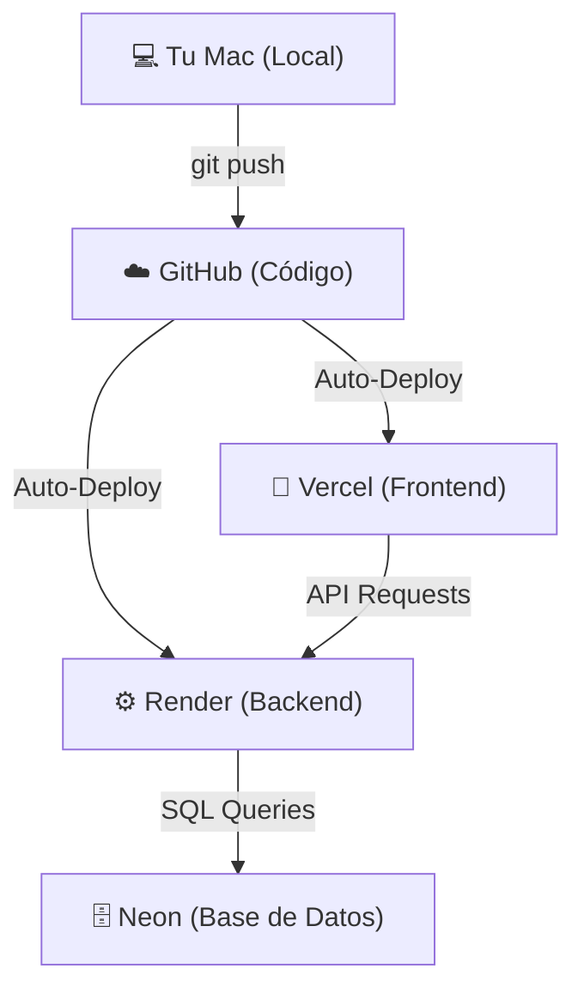

# Arquitectura de Despliegue: AbTech

## Flujo de Trabajo Simplificado

## Resumen

1.  **Tu Mac**: Donde creas la magia.
2.  **GitHub**: Donde se guarda la magia.
3.  **Vercel & Render**: Donde la magia cobra vida para el mundo.
4.  **Neon**: Donde la magia recuerda cosas.

---

## 💰 Capacidad del Plan Gratuito (Free Tier)

Esta es la cantidad de aplicaciones similares (Angular + Spring Boot + Postgres) que puedes tener con tu cuenta actual sin pagar:

### 1. GitHub (Código)
*   **Capacidad**: **Ilimitada**.
*   Puedes crear todos los repositorios (proyectos) públicos o privados que quieras.

### 2. Vercel (Frontend - Hobby)
*   **Capacidad**: **Ilimitada** (Uso Personal).
*   Puedes desplegar tantos frontends (Angular, React) como desees, siempre que no sean para uso comercial masivo.
*   Límites: ~100GB de ancho de banda/mes y tiempos de construcción razonables.

### 3. Render (Backend - Spring Boot)
*   **Capacidad**: **1 Aplicación activa 24/7**.
*   **Explicación**: Render te da **750 horas gratis** de cómputo al mes.
    *   1 mes tiene ~744 horas. Por lo tanto, puedes tener **1 backend** corriendo todo el tiempo.
    *   Si quieres tener más apps, estas entrarán en "suspensión" (se apagan cuando nadie las usa) para no consumir tus 750 horas. De esa forma podrías tener 2 o 3, pero tardarán unos segundos en "despertar" al entrar.

### 4. NeonTech (Base de Datos)
*   **Capacidad**: **1 Proyecto Principal**.
*   Neon ofrece **1 Proyecto Gratuito** con:
    *   3 GB de almacenamiento.
    *   10 Ramas (Branches).
    *   **Truco**: Dentro de ese único "Proyecto", puedes crear varias bases de datos o esquemas (ej: `db_abtech`, `db_barberia`, `db_tienda`), siempre y cuando la suma total de datos no pase de 3 GB.

### 🚨 Conclusión
Tu "cuello de botella" es **Neon** (1 Proyecto) y **Render** (1 App activa simultánea).

*   **Para tener más apps**:
    *   En **Render**: Deja que se suspendan (spin-down) cuando no se usen.
    *   En **Neon**: Reutiliza el mismo proyecto creando diferentes bases de datos dentro de él.
